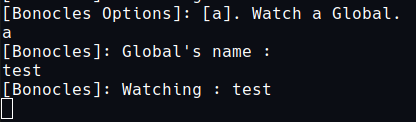

# Binocles
Debugging Love2D in a simple way.

Binocles is a module base on Monocle https://github.com/kjarvi/monocle.
this module give the ability to easily :
  1. watch variables and complex expressions
  2. watch files and reload them when they change
  3. Reloads the game after any watched files have been changed.
  4. Custom colors
  5. Add Global variables to the listener from the console by providing there name.

The setup of a basic main.lua file is as follows:

Note : Make sure to run the game from the console or use --console so you can see the listener output.

```lua
Object   = require "classicc";
Binocles = require "binocles";

--Test variable
test = 0;

function love.load(arg)
  watcher = Binocles({
      active = true,
      customPrinter = true,
      debugToggle =   'f1',
      consoleToggle = 'f2',
      colorToggle   = 'f3',
      watchedFiles = {
        'main.lua',
      },
    });
    -- Watch the FPS
    watcher:watch("FPS", function() return math.floor(1/love.timer.getDelta()) end);
    -- Watch the test global variable
    watcher:watch("test",function() return test end);
end


function love.update(dt)
  watcher:update();
end

function love.draw()
  watcher:draw();
end

function love.keypressed(key)
  test = test + 1; -- inc test every time a key is pressed
  watcher:keypressed(key);
end
```

Options :

```lua
options.active -- if bonocles is active (drawing)  
options.customPrinter -- activate printing to console
options.draw_x -- x pos of the Bonocles instance (Used in :draw())
options.draw_y  -- y pos of the Bonocles instance (Used in :draw())
options.printColor -- text color (will be sent to love.graphics.setColor())
options.debugToggle -- Toggle (change the satate of self.active)
options.consoleToggle -- Start the interaction with the listener from the console
options.colorToggle -- toggle to change the printing color
options.watchedFiles  -- files to watch

options.restart --[[
* if true :  Restarts the game without relaunching the executable. This cleanly shuts down the main Lua state instance and creates a brand new one.
* if false : will reload only the watched file if he got modified (ctrl-s).
]]--

```

Console Example :




| Paragraphe | Enjeux         | Justification                                                |
| ---------- | -------------- | ------------------------------------------------------------ |
| 2          | informatif     | Ils nous ont informés que Le vaccin choisi par le gouvernement marocain provient de la société chinoise "Sinopharma" |
| 2          | informatif     | Ils nous ont informés que  le vaccin a été testé sur près d’un million de personnes dans le monde |
| 2          | influence      | Le commentaires du ministre de la santé Khalid Ait Taleb sur la qualité des tests et les essais |
| 4          | informatif     | Ils nous ont informés que Le gouvernement prépare 2880 stations médicales |
| 4          | influence      | Toute la population devrait être vaccinée d’ici la fin du mois de mars 2021 |
| 4          | informatif     | Ils nous ont informés que La campagne de vaccination devrait débuter dans le courant du mois de décembre et que Le gouvernement marocain suit les recommandations de l’OMS et ciblera d’abord les personnels soignants, les personnes âgées et les individus à risque. |
| 6          | positionnement | le positionnement de la part du Roi Mohammed  VI par rapport de cette campagne : il a donné l’impulsion de cette campagne à grande échelle. |
| 6          | positionnement | de la part de Christian Leyens qui dit que le maroc a pris de bonnes mesures *grâce à Sa Majesté.* |
|            |                |                                                              |


